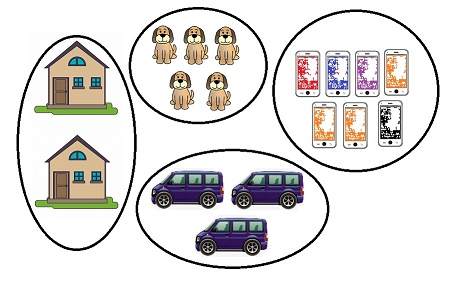
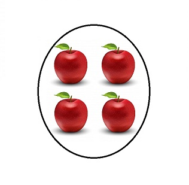
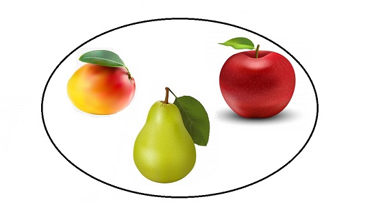
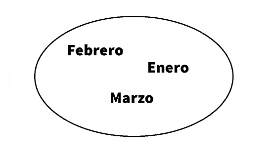

# **Conjuntos**
Los conjuntos son la base de toda la matematica como la conocemos hoy en dìa y para entender que es un conjunto vamos a conocer los siguientes conceptos 

* **Elementos**
* **caracteristicas comunes del conjuto**
* **propiedad caracteristica del conjunto**
---
## **Elementos**
___

Fijate en la siguiente imagen:

___
Los objetos dentro de ella, el carro, la tetera, y los objetos en general, absolutamente todos ellos desde ahora lo llamaremos **Elementos**.

 * El automovil es un **Elemento**
 * El dado es un **Elemento**
 * La maleta es un **Elemento**
 * Tu eres un **Elemento**

___

___
Los conjuntos formados en esta imagen son:

* Un conjunto de casas.
* Un conjunto de perros.
* Un conjunto de telefonos.
* Un conjunto de automoviles.
___

Pero aqui tenemos varios **elementos**, expecíficamente 4 manzanás. Si a estos elementos los reunimos de alguna forma para diferenciarlo de otros, como por ejemplo, con una linea curva (como en la imagen). A esto lo llamaremos **Conjunto**, en este caso un conjunto de manzanas, ¡ahora ya sabes que es un conjunto!

> **pre definición**: Un **Conjunto** es una **reunion** de **elementos**

___
## **Caracteristicas comunes del Conjuto**
___

 Observa que hasta ahora los conjuntos que he formado tienén un solo elemento repetido, casas, perros, etc. Pero ahora vamos a formar un conjunto con elementos distintos-

 

¿**Como podemos llamar a este conjunto**?

Antes deciamos, un conjunto de perros, un conjunto de ... el nombre del elemento que formaba ese conjunto, ahora tenemos que decir un conjunto formado por una manzana, una pera y un mango, por lo tanto, tendriamos que nombrar todos los elementos del conjunto;  

¿**Y si el conjunto tiene muchos elementos, digamos que 100**?

 Serìa muy difícil, veamos como podemos solucionarlo; busquemos algo que sea comùn a todos los elementos por igual. 

* **Son frutas** 
* **se pueden comer**
* **tienen nutrientes**

Estos son aspectos comunes que tienen los elementos de ese conjunto, entonces estos aspectos que son comunes a todos los elementos de un conjunto los llamaremos **Caracteristicas comunes del Conjuto**.

Ahora observa con atención, las **Características comunes del Conjuto** tambien las puede poseer otros elementos que no esten en el conjunto, por ejemplo:  una guayaba, una banana, una lechosa, etc, todos ellos cumplen esas caracteristicas comunes y no estàn en el conjunto.

___
## **Propiedad caracteristica del conjunto**
___

 ¿**Tu crees que es posible encontrar una característica común**?
 
Si contestaste que si estas en lo correcto, y esa característica seria "ser los tres primeros meses del año" o "el primer tercio de meses del año"

Observando la respuesta, no existe ningun otro elemento que se pueda asociar a este conjunto, bueno a esto le llamamos **Propiedad Característica del conjunto**
___
## **Definicion:**

>## Un **conjunto** es una **reunión** de **elementos** que tienen una **propiedad caracteristica** 

